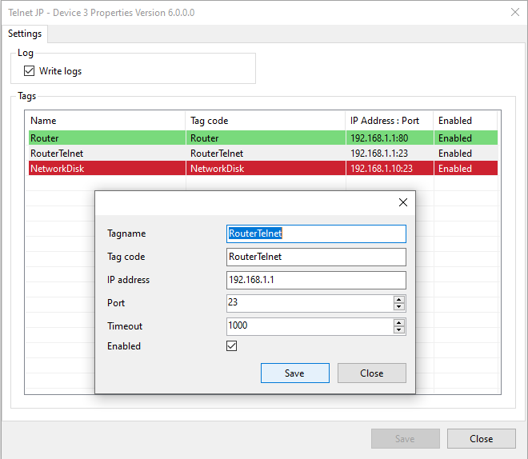

# DrvTelnetJP

[English](README.md) · [Русский](README.ru.md) · [English help](Help/en/index.md) · [Русская справка](Help/ru/index.md)

Контролирует доступность подключений к настроенным TCP-портам.

## Основные возможности

- Проверка доступности TCP-портов по IP-адресу или DNS-имени.
- Отдельный узел, порт, таймаут, код канала и признак включения для каждого тега.
- Автоматическое создание прототипов каналов по списку тегов.
- Период опроса по умолчанию 1 секунда в модуле настройки.
- Опциональный вывод журнала драйвера.

## Скриншоты

## Видео

- [Демонстрация DrvTelnetJP — YouTube](https://www.youtube.com/watch?v=TGCN7rIGmP8)

[Лицензия и условия использования](Help/ru/license.md) · [Поддержка](https://forum.rapidscada.ru/?topic=drvtelnetjp)
