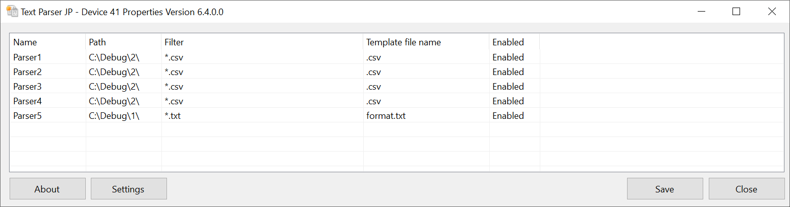
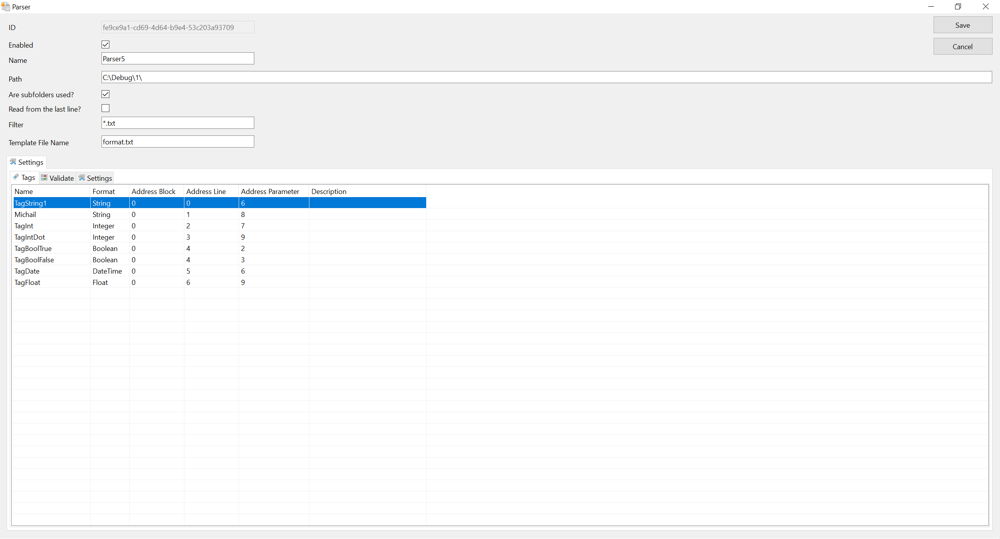

# DrvParserTextJP

[English](README.md) · [Русский](README.ru.md) · [English help](Help/en/index.md) · [Русская справка](Help/ru/index.md)

Parses text files and maps their contents to Rapid SCADA tags.

## Screenshots

## Video

- [Demonstration of DrvParserTextJP — 1 — YouTube](https://youtu.be/t9LyHzDUzmo?si=giMWBqSsCHaqGY7n)
- [Demonstration of DrvParserTextJP — 2 — Rutube](https://rutube.ru/video/78239cf1a34e714c75cd883a314240bf/)

[License and usage conditions](Help/en/license.md)
