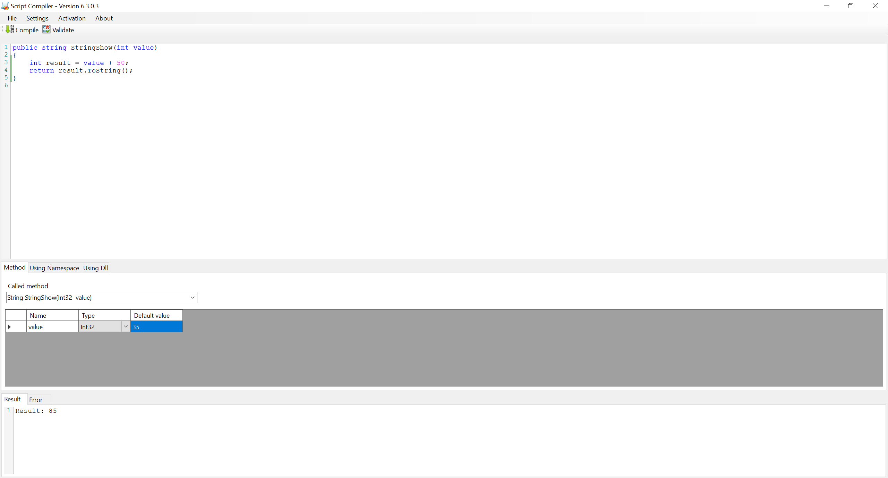
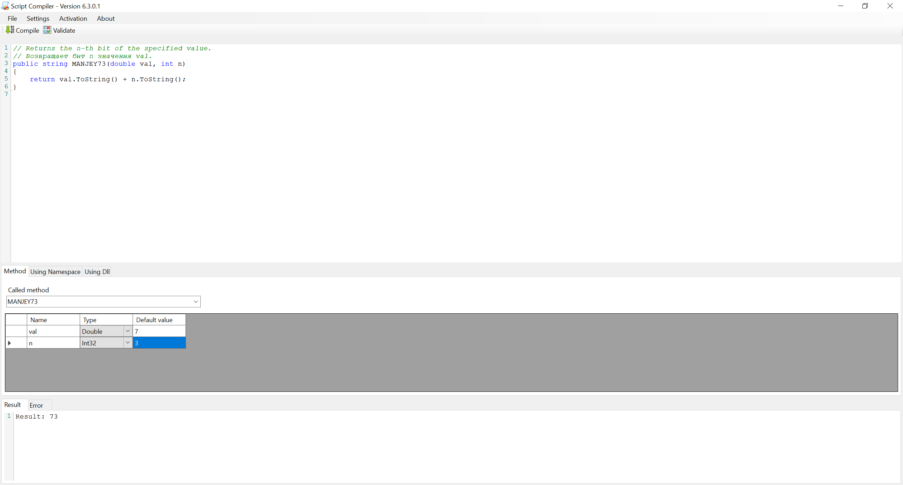

# ExtScriptCompilerJP

[English](README.md) · [Русский](README.ru.md) · [English help](Help/en/index.md) · [Русская справка](Help/ru/index.md)

Provides script editing and compilation tools for Rapid SCADA Administrator.

## Screenshots

[License and usage conditions](Help/en/license.md)
