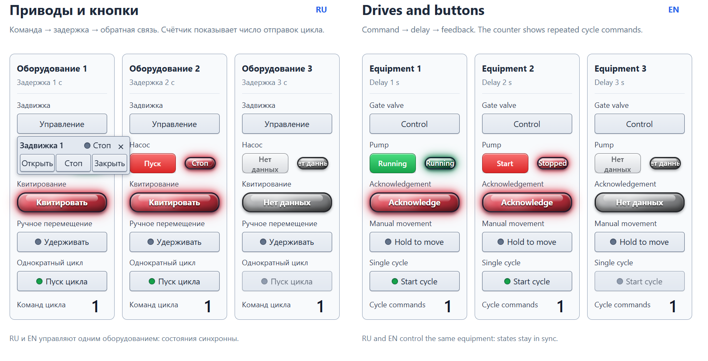
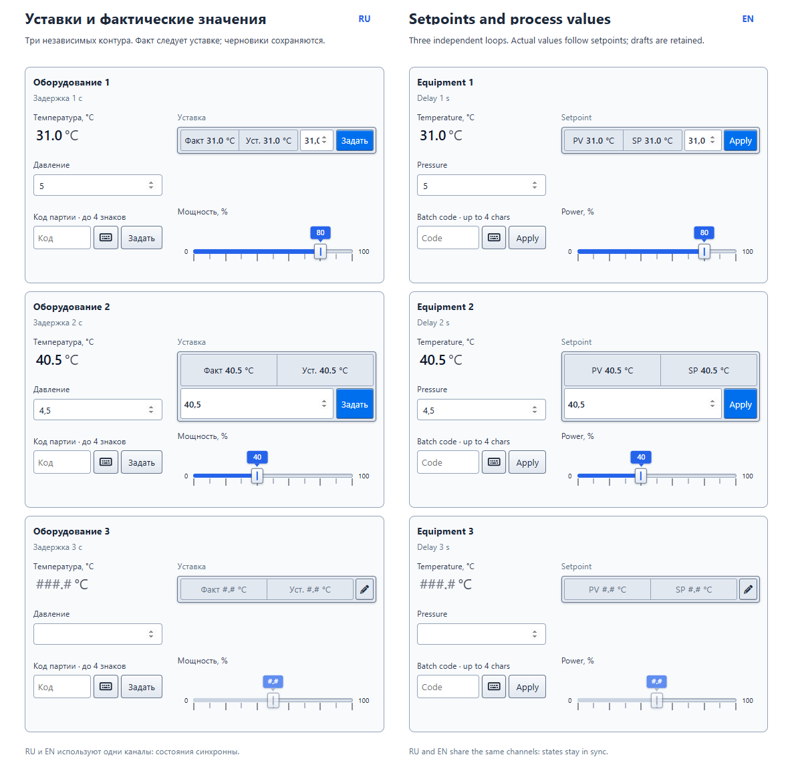

# PlgMimControlsJP

[English](README.md) · [Русский](README.ru.md) · [English help](Help/en/index.md) · [Русская справка](Help/ru/index.md)

Adds operator controls with confirmed feedback to Rapid SCADA mimic diagrams.

## Highlights

- nineteen display, selection, command and multi-value form components, plus an autonomous demo;
- standard Rapid SCADA input and output channel bindings;
- numeric, UTF-8 text and exact Hex-byte commands where applicable;
- confirmed-state rendering without optimistic state changes;
- optional command-pending frame with a configurable color;

## Screenshots

## Video

- [Demonstration of PlgMimControlsJP](https://jurasskpark.ru/files/github/PlgMimControlsJP.mp4)

Commercial product. [License and usage conditions](Help/en/license.md)
