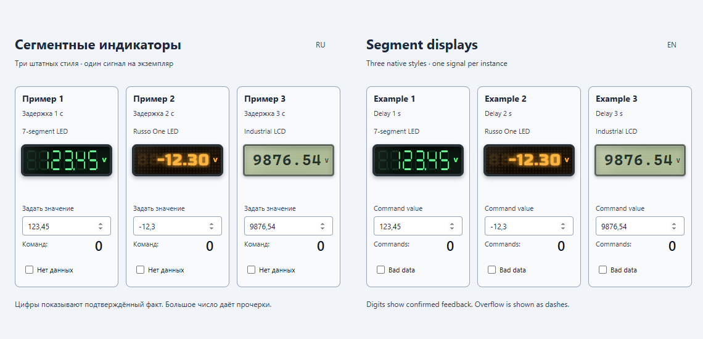
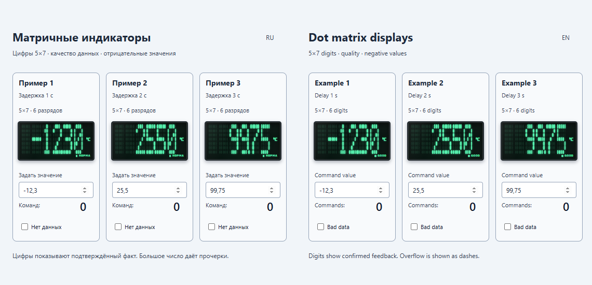
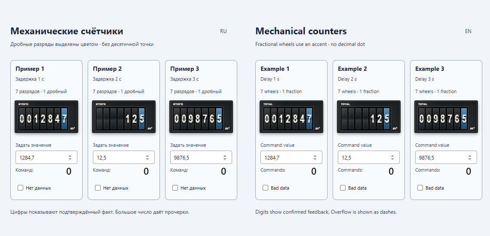
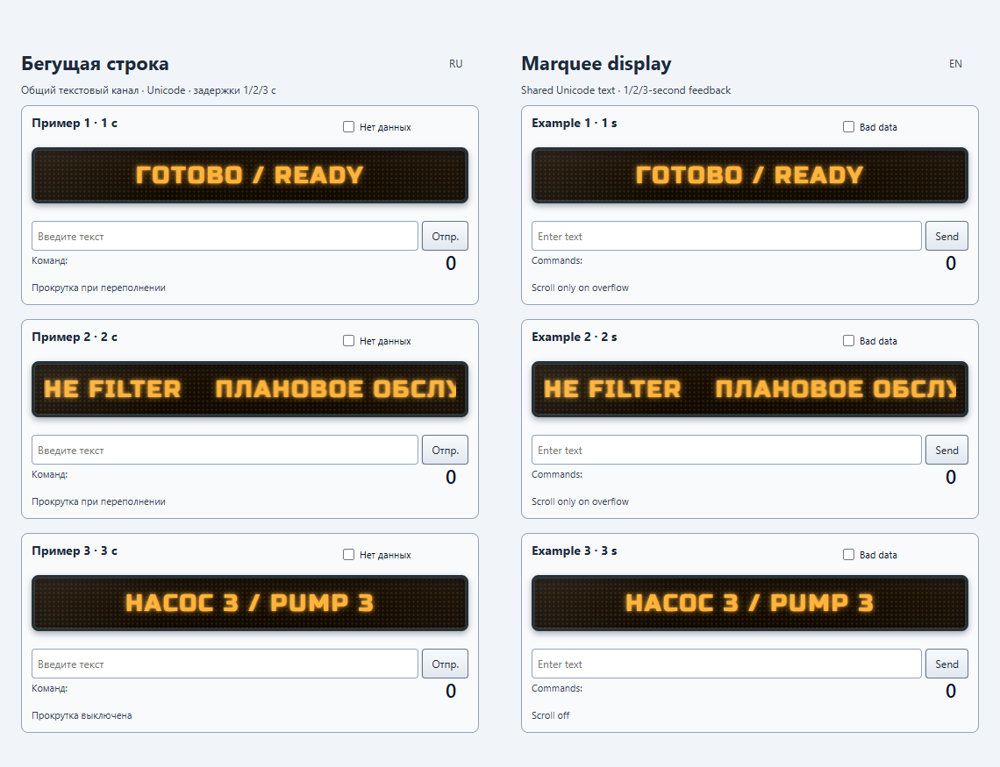
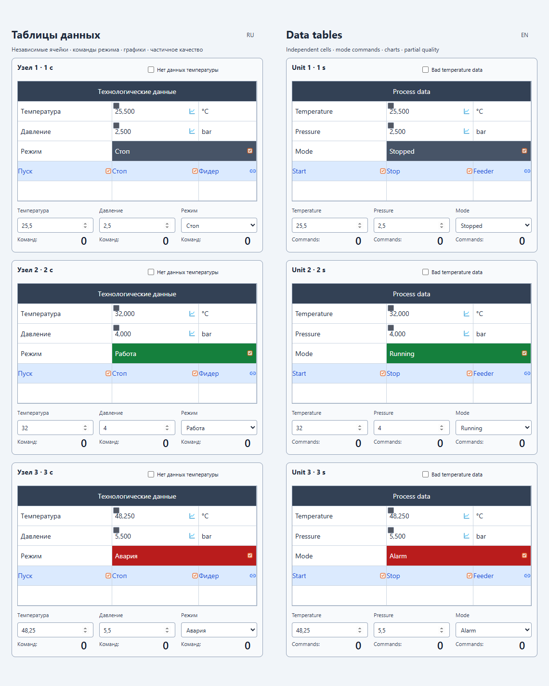
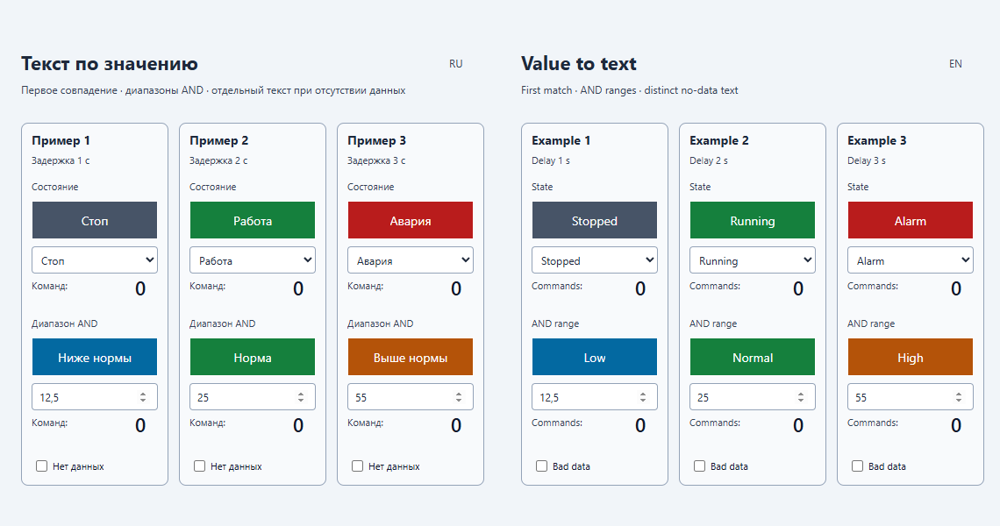

# PlgMimDisplayJP — Галерея скриншотов PNG

[Оглавление](index.md) · [Продукт](../../README.ru.md) · [English](../en/screenshots.md)

Снято **2026-10-10** из меню Display JP локальной Вебстанции, представления **51001–51006**. PNG содержат полную схему при масштабе 100%, без меню хоста, событий и плавающей панели. При съёмке элементы управления схем не использовались и команды не отправлялись. Половины EN/RU являются частью исходных схем.

## Сегментные, текстовые светодиодные и ЖК-панели

Представление 51001 · [Настройки SegmentDisplay](segment-display.md)

## Матричные цифры с подписями качества

Представление 51002 · [Настройки DotMatrixDisplay](dot-matrix-display.md)

## Числовые барабаны и дробная точность

Представление 51003 · [Настройки MechanicalCounter](mechanical-counter.md)

## Произвольный текст и прокрутка при переполнении

Представление 51004 · [Настройки MarqueeDisplay](marquee-display.md)

## Объединённые ячейки, измерения и действия

Представление 51005 · [Настройки DataTableDisplay](data-table-display.md)

## Упорядоченные правила значений, текст и цвета

Представление 51006 · [Настройки ValueTextDisplay](value-text-display.md)

