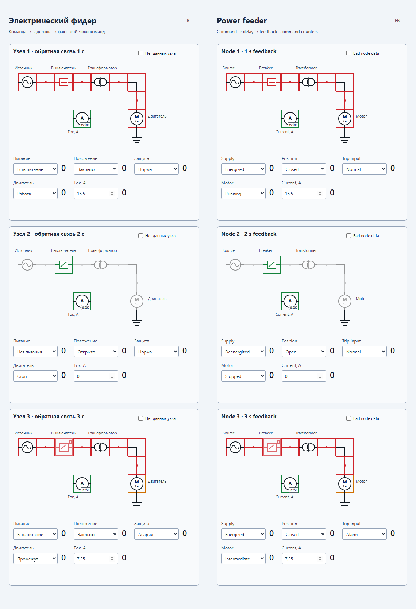
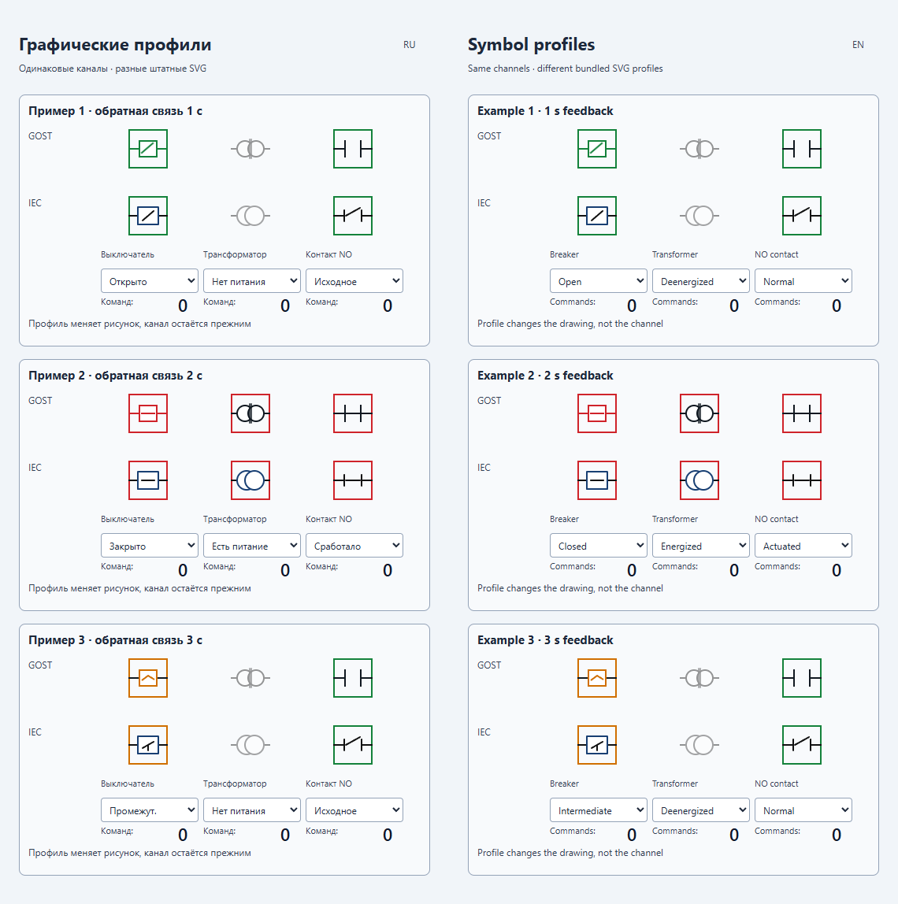

# PlgMimElectricJP — Скриншоты

[Оглавление](index.md) · [Продукт](../../README.ru.md) · [English](../en/screenshots.md)

PNG-снимки предоставленных локальных представлений Вебстанции 41001–41012, снятые **2026-10-10** в **масштабе 100%**. Каждый снимок содержит мнемосхему целиком, включая нижние ряды длинных каталогов. Подписи внутри изображений сохраняют языки исходных представлений.

| Представление | Тема и PNG | Размер, пикселей |
| --- | --- | --- |
| 41001 | [Электрический фидер](../../Source/PlgMimElectricJP_001.png) | 1140 × 1668 |
| 41002 | [Электроснабжение](../../Source/PlgMimElectricJP_002.png) | 1140 × 4251 |
| 41003 | [Релейное управление](../../Source/PlgMimElectricJP_003.png) | 1140 × 2954 |
| 41004 | [Приборы и измерения](../../Source/PlgMimElectricJP_004.png) | 1140 × 3296 |
| 41005 | [ПЛК и модули ввода-вывода](../../Source/PlgMimElectricJP_005.png) | 1140 × 1290 |
| 41006 | [Кабели и соединения](../../Source/PlgMimElectricJP_006.png) | 1140 × 3563 |
| 41007 | [Пожарная автоматика](../../Source/PlgMimElectricJP_007.png) | 1140 × 1290 |
| 41008 | [Охрана и доступ](../../Source/PlgMimElectricJP_008.png) | 1140 × 1290 |
| 41009 | [Промышленные сети](../../Source/PlgMimElectricJP_009.png) | 1140 × 1244 |
| 41010 | [Пользовательский прибор](../../Source/PlgMimElectricJP_010.png) | 1140 × 389 |
| 41011 | [Привязки и защита](../../Source/PlgMimElectricJP_011.png) | 1140 × 1448 |
| 41012 | [Графические профили](../../Source/PlgMimElectricJP_012.png) | 1140 × 1148 |

## Электрический фидер

## Графические профили

