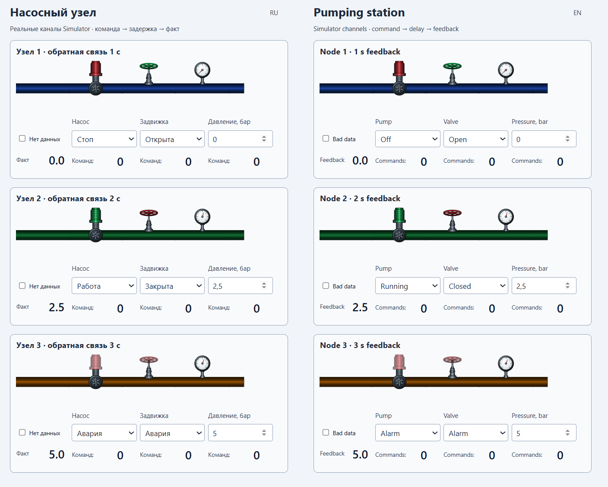
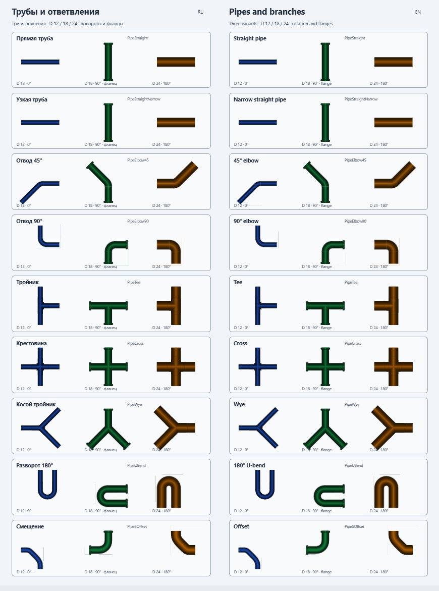

# PlgMimPipesJP

[English](Readme.md) · [Русский](README.ru.md) · [English help](Help/en/index.md) · [Русская справка](Help/ru/index.md)

Adds pipe layouts and equipment indicators to Rapid SCADA mimic diagrams.

## Highlights

- straight and narrow straight pipes;
- 45° and 90° elbows;
- tee, cross and Y branches;
- U-bend and S-offset;
- concentric reducer, expansion joint and flexible section;

## Screenshots

## Video

Pipe components in a running Rapid SCADA mimic and their configuration in the editor.

- [Demonstration of PlgMimPipesJP](https://jurasskpark.ru/files/github/PlgMimPimpJP.mp4)

Commercial product. [License and usage conditions](Help/en/license.md)
