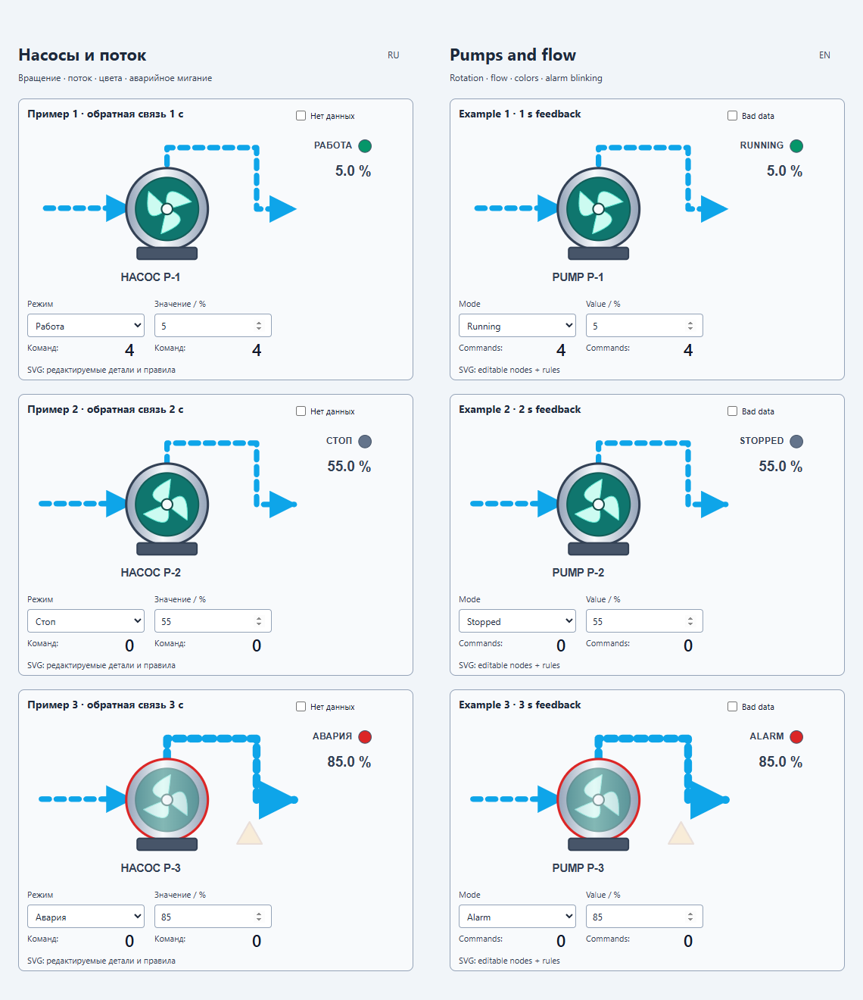
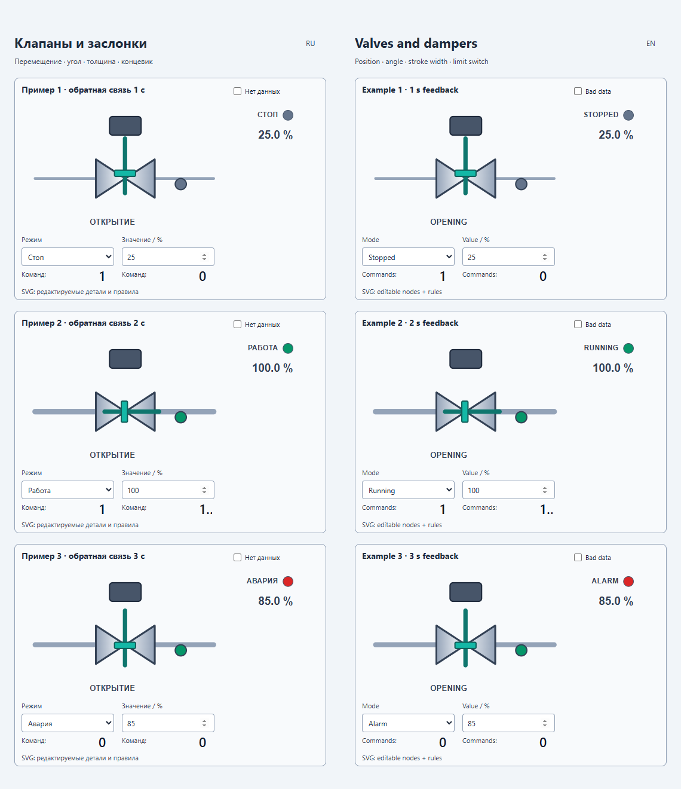
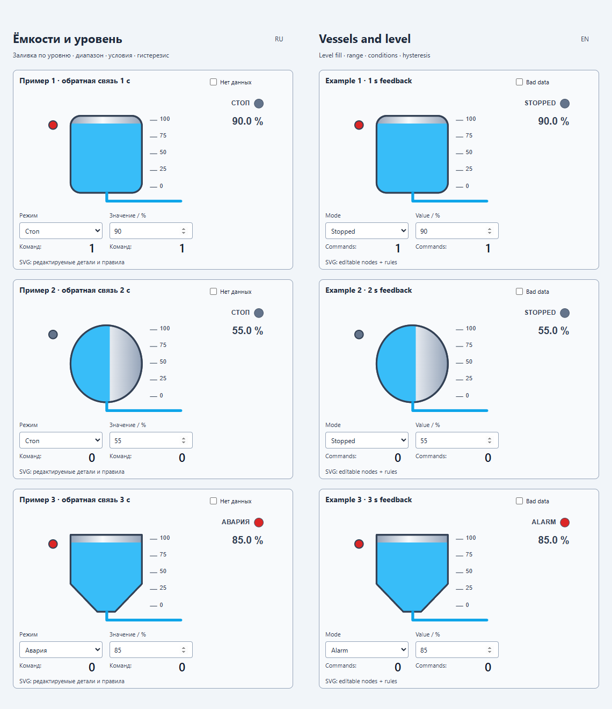
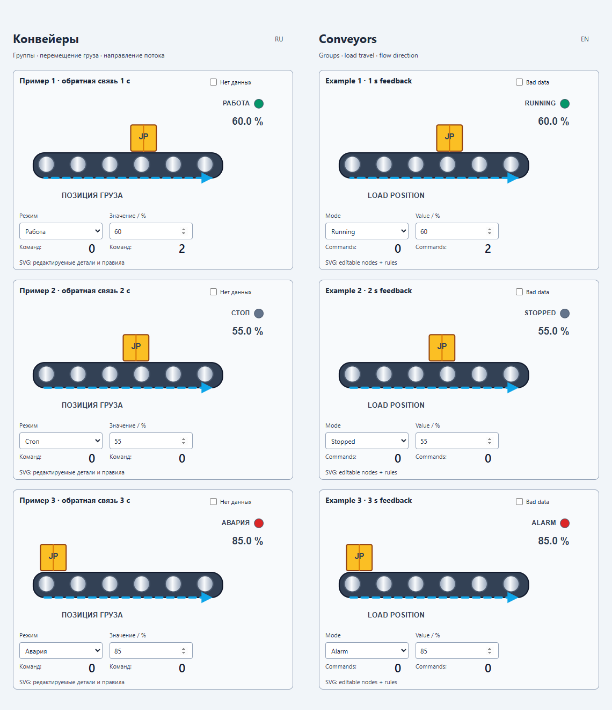
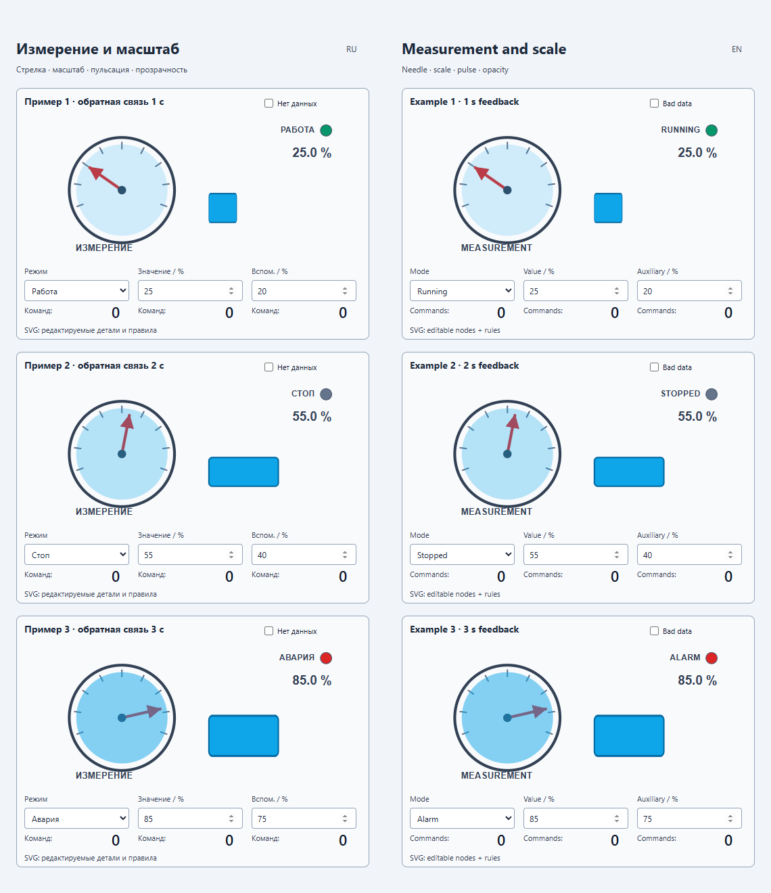
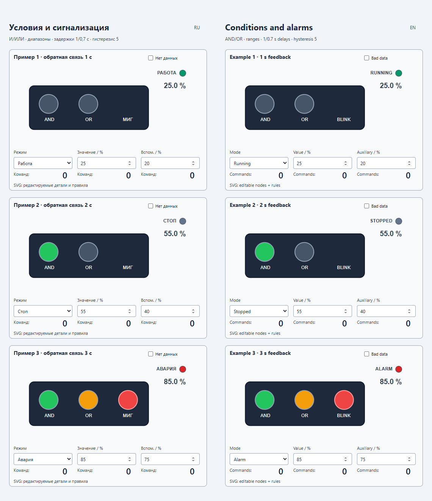
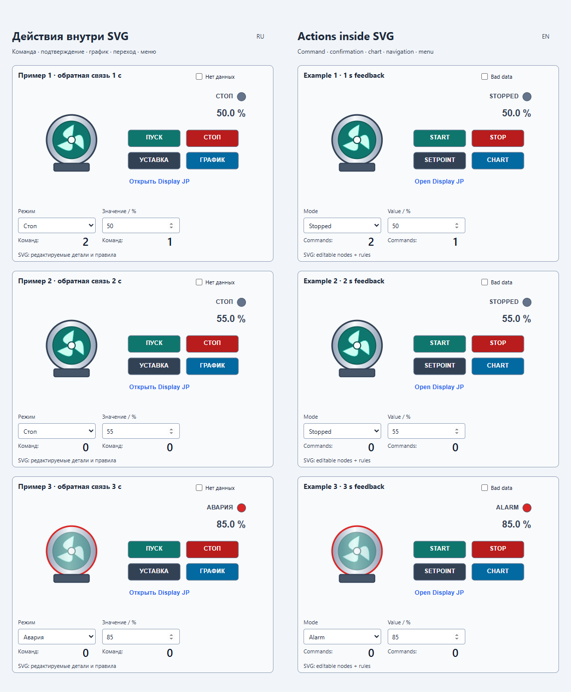
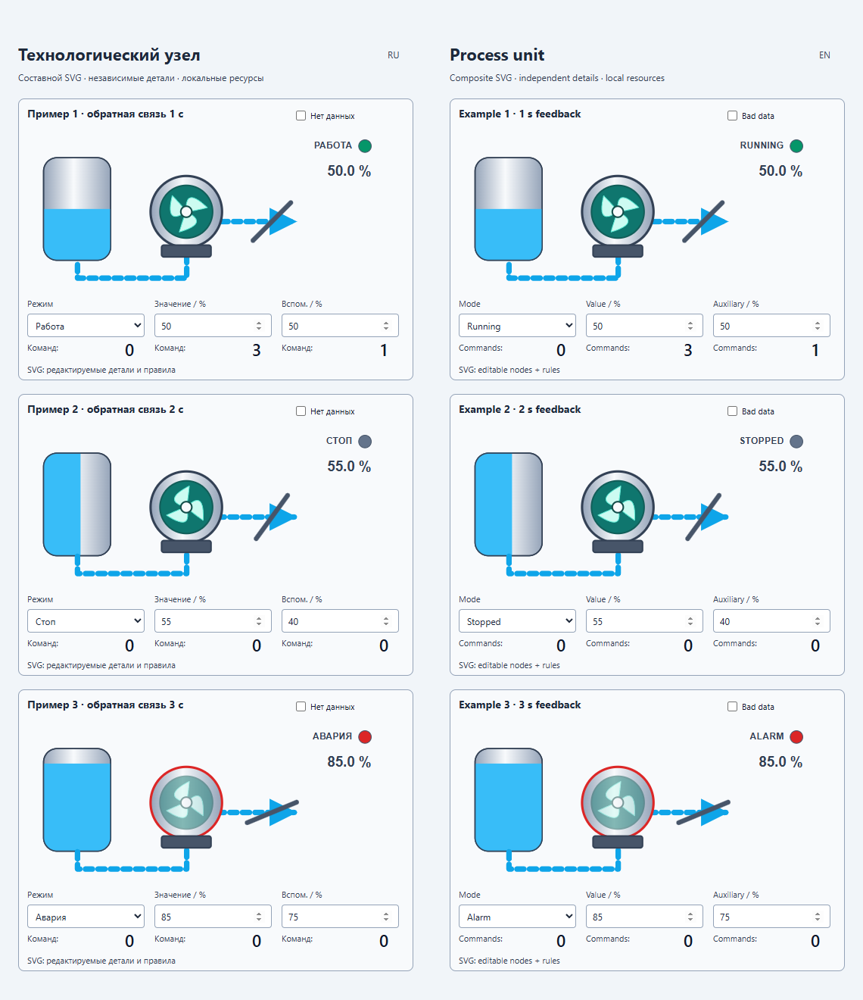
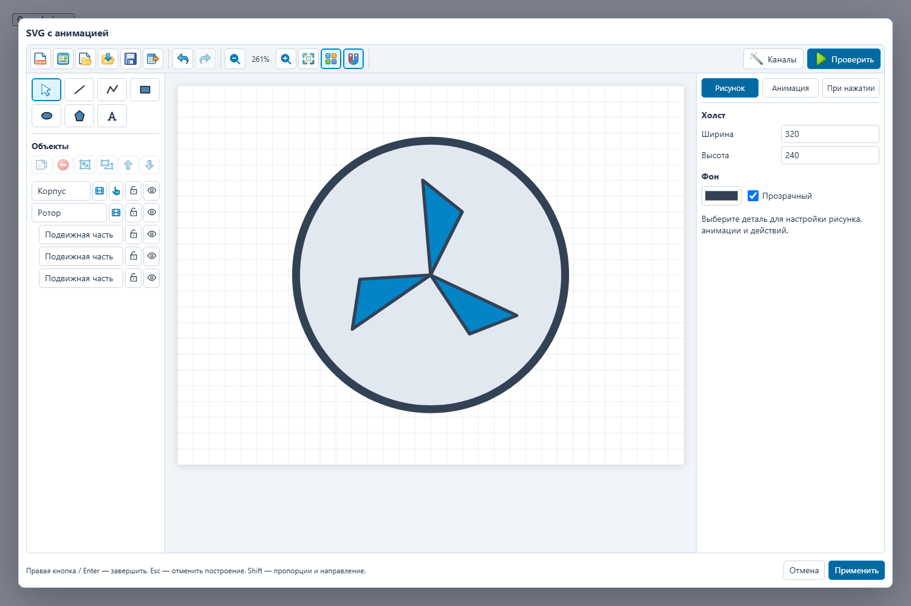

# PlgMimSVGAnimationJP — Примеры Вебстанции и галерея PNG

[Оглавление](index.md) · [Продукт](../../README.ru.md) · [English](../en/screenshots.md)

## Происхождение изображений

Изображения `001–008` — PNG всей мнемосхемы локальных представлений Вебстанции `61001–61008` от `2026-10-10`. На каждой странице три независимых случая с русской/английской копиями, читающими одни каналы, и подготовленными задержками обратной связи 1/2/3 секунды. При съёмке элементы управления не использовались, команды не отправлялись.

Изображение `009` — неизменённая копия существующего `Tests/Browser/artifacts/standard-designer.png` исходного проекта. Оно показывает русский интерфейс дизайнера; исходная дата съёмки и проверенная сборка этим оформлением документации не устанавливаются.

PNG находятся в `Source` с именами от `PlgMimSVGAnimationJP_001.png` до `PlgMimSVGAnimationJP_009.png`. Иллюстративные файлы SVG не копировались.

## Что показывает локальный проект

Исходная инструкция `Build/Scripts/Demo/README-SVGAnimationJP.md` описывает 48 редактируемых сцен на восьми страницах, все 11 анимируемых свойств и 21 сочетание свойства с режимом. Геометрия принадлежит этому плагину: группы, контуры, градиенты, обрезка и стрелки, без зависимости выполнения от других плагинов символов оборудования.

Страница `61006` использует И для значения >50 и вспомогательного ≥30 с задержками включения 1 с и отключения 0,7 с. Гистерезис 5 удерживает порог до значения ≤45. ИЛИ реагирует на значение вне 20–80 или режим 2. Недостоверное качество замораживает зависимые детали, а независимые продолжают работу; на странице действий оно также делает обратную связь режима недостоверной и блокирует команды.

Локальный пример использует каналы/устройства `61000–79999` и префикс кода `Demo.SVGAnimationJP.*`. Назначения сигнала: факт +0, команда +70, счётчик +71, синус +72 и аналоговый выход +73. Карта описана в `svganimation-demo-manifest.json`; дополнительные сцены открываются из `Scenes/*.svganim.json`. Графики используют `ChartFeature` и требуют истории архива. Эти назначения конкретного проекта не являются значениями установки по умолчанию.

## Насосы и поток — 61001

## Клапаны и обратная связь привода — 61002

## Ёмкости и уровень — 61003

## Конвейеры и перемещение — 61004

## Измерения и индикация — 61005

## Условия и сигнализация — 61006

## Действия внутри SVG — 61007

## Составной технологический узел — 61008

## Дизайнер символа

[36 шаблонов HelloWorld](examples.md) · [Дизайнер](designer.md) · [Границы материалов](sources.md)
