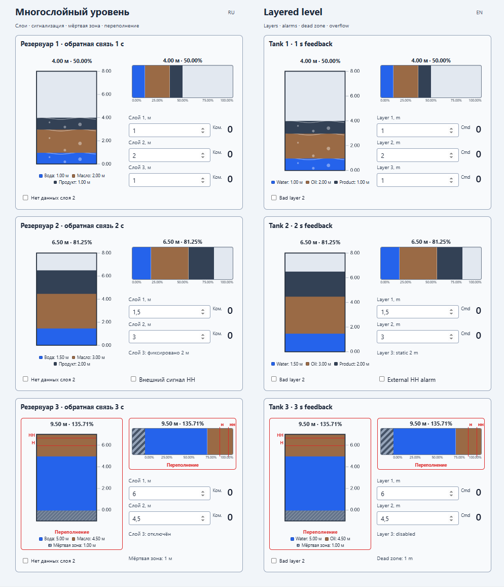
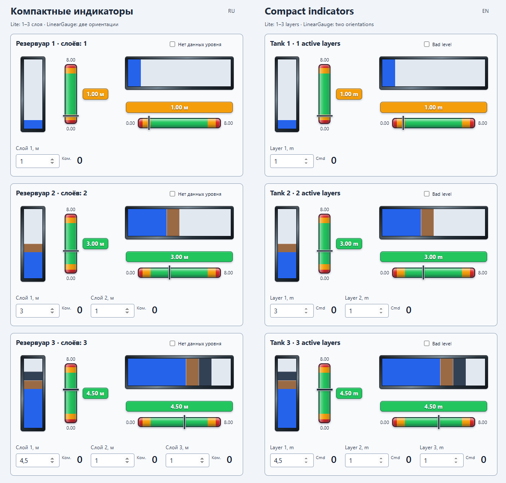

# PlgMimTankJP

[English](Readme.md) · [Русский](README.ru.md) · [English help](Help/en/index.md) · [Русская справка](Help/ru/index.md)

Adds tank, vessel and level indicators to Rapid SCADA mimic diagrams.

## Highlights

- vertical and horizontal three-layer level indicators;
- compact channel-driven Lite indicators;
- a separate five-zone linear gauge;
- eight industrial SVG vessel types;
- one to three independently configured liquid or product layers;

## Screenshots

## Video

Vessel components in a running Rapid SCADA mimic and their configuration in the editor.

- [Demonstration of PlgMimTankJP](https://jurasskpark.ru/files/github/PlgMimTankJP.mp4)

Commercial product. [License and usage conditions](Help/en/license.md)
